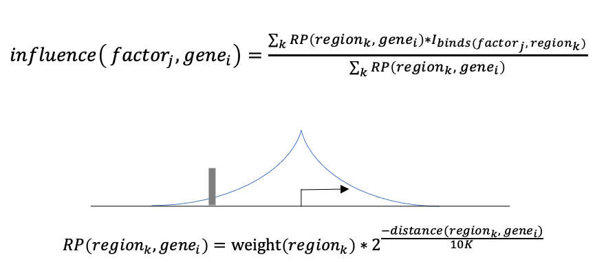

# LISA Data Analysis Tutorial

- [Which Factors Influence my Genes](#Which-Factors-Influence-my-Genes)
- [Which Genes do my Factors Target](#Which-Genes-do-my-Factors-Target)
- [How was the Geneset Modeled](#How-was-the-Geneset-Modeled)


In this tutorial, we analyze LISA results from the Web API/FromGenes test and explore how LISA arrived at its factor predictions. Our genes-of-interest are the down-regulated genes from a SOX2 knockout experiment, which you can download from the Hg38 gallery (GEO id: GSE59234). 

To run this test yourself, simply paste the genes into the ``Gene Set 1`` box and label the list ``SOX2_Down``. I used ChIP-seq data to represent TF binding locations, but you may use motif hits as well.

I gave my job the name ``Tutorial`` and hit ``Run``. 


After LISA has made its predictions, hit the ``Download Results`` tab and unpack your genes into a folder called "data", now we can begin our analysis. Alternatively, you can save your genelist to a file called ``SOX2_Down.txt``, and use the LISA command-line package:

```
$ lisa oneshot hg38 SOX2_down.txt -b 500 -o data/SOX2_Down --save_metadata
```

To analyze our results, first use Pandas to read the tabular file suffixed with ``.lisa.tsv``, and json to read the unstructured test metadata suffixed with ``.metadata.json``. 

If you do not have pandas installed, use the command ```pip install pandas``` or ```conda install pandas```.


```python
import pandas as pd
import numpy as np
import json
```


```python
results = pd.read_csv('data/Tutorial_2021-01-21-074335-556/SOX2_Down.lisa.tsv', sep = '\t')

with open('data/Tutorial_2021-01-21-074335-556/SOX2_Down.metadata.json', 'r') as f:
    metadata = json.load(f)
```

## Which Factors Influence my Genes

Each row in the tabular results shows the p-value and metadata associated with one factor hit profile assessed for influence on our genes. Our motif database includes roughly one motif per factor but our ChIP-seq database, used here, stores many duplicates for each factor to cover different conditions. 

That is why when we show the top results, we can see that similar NANOG, SMAD3, POU5F1, and SOX2 binding profiles dominate the rankings.


```python
results.head(20)
```


<div>
<table border="1" class="dataframe">
  <thead>
    <tr style="text-align: right;">
      <th></th>
      <th>Rank</th>
      <th>sample_id</th>
      <th>factor</th>
      <th>cell_line</th>
      <th>cell_type</th>
      <th>tissue</th>
      <th>DNase_p_value</th>
      <th>ChIP-seq_p_value</th>
      <th>H3K27ac_p_value</th>
      <th>summary_p_value</th>
    </tr>
  </thead>
  <tbody>
    <tr>
      <th>0</th>
      <td>1</td>
      <td>4932</td>
      <td>NANOG</td>
      <td>H1</td>
      <td>Embryonic Stem Cell</td>
      <td>Embryo</td>
      <td>3.982389e-15</td>
      <td>3.611972e-16</td>
      <td>1.729447e-10</td>
      <td>9.992007e-16</td>
    </tr>
    <tr>
      <th>1</th>
      <td>2</td>
      <td>4933</td>
      <td>NANOG</td>
      <td>H1</td>
      <td>Embryonic Stem Cell</td>
      <td>Embryo</td>
      <td>2.417696e-15</td>
      <td>1.125848e-15</td>
      <td>1.279806e-08</td>
      <td>2.331468e-15</td>
    </tr>
    <tr>
      <th>2</th>
      <td>3</td>
      <td>71285</td>
      <td>SMAD3</td>
      <td>None</td>
      <td>hESC</td>
      <td>None</td>
      <td>1.423483e-13</td>
      <td>1.340355e-13</td>
      <td>8.062901e-11</td>
      <td>2.069456e-13</td>
    </tr>
    <tr>
      <th>3</th>
      <td>4</td>
      <td>57188</td>
      <td>NANOG</td>
      <td>None</td>
      <td>Embryonic Stem Cell</td>
      <td>None</td>
      <td>1.147403e-12</td>
      <td>1.363998e-13</td>
      <td>3.818740e-07</td>
      <td>3.657630e-13</td>
    </tr>
    <tr>
      <th>4</th>
      <td>5</td>
      <td>71284</td>
      <td>SMAD3</td>
      <td>None</td>
      <td>hESC</td>
      <td>None</td>
      <td>4.217043e-13</td>
      <td>2.178160e-13</td>
      <td>1.856531e-10</td>
      <td>4.306000e-13</td>
    </tr>
    <tr>
      <th>5</th>
      <td>6</td>
      <td>34089</td>
      <td>NANOG</td>
      <td>HUES64</td>
      <td>Embryonic Stem Cell</td>
      <td>Embryo</td>
      <td>2.425672e-11</td>
      <td>3.028646e-12</td>
      <td>1.437154e-07</td>
      <td>8.077317e-12</td>
    </tr>
    <tr>
      <th>6</th>
      <td>7</td>
      <td>51516</td>
      <td>NANOG</td>
      <td>HUES64</td>
      <td>Embryonic Stem Cell</td>
      <td>Embryo</td>
      <td>2.440703e-11</td>
      <td>3.722352e-12</td>
      <td>8.819708e-08</td>
      <td>9.689027e-12</td>
    </tr>
    <tr>
      <th>7</th>
      <td>8</td>
      <td>63137</td>
      <td>POU5F1</td>
      <td>None</td>
      <td>iPSC</td>
      <td>None</td>
      <td>7.091393e-12</td>
      <td>1.726089e-11</td>
      <td>2.114001e-06</td>
      <td>1.507910e-11</td>
    </tr>
    <tr>
      <th>8</th>
      <td>9</td>
      <td>51520</td>
      <td>NANOG</td>
      <td>HUES64</td>
      <td>Embryonic Stem Cell</td>
      <td>Embryo</td>
      <td>1.072564e-10</td>
      <td>3.245251e-11</td>
      <td>1.687911e-08</td>
      <td>7.463247e-11</td>
    </tr>
    <tr>
      <th>9</th>
      <td>10</td>
      <td>955</td>
      <td>NANOG</td>
      <td>H1</td>
      <td>Embryonic Stem Cell</td>
      <td>Embryo</td>
      <td>4.185201e-11</td>
      <td>6.380190e-06</td>
      <td>1.562268e-09</td>
      <td>1.222795e-10</td>
    </tr>
    <tr>
      <th>10</th>
      <td>11</td>
      <td>51513</td>
      <td>NANOG</td>
      <td>HUES64</td>
      <td>Embryonic Stem Cell</td>
      <td>Embryo</td>
      <td>9.842139e-10</td>
      <td>1.798330e-10</td>
      <td>2.441284e-06</td>
      <td>4.561237e-10</td>
    </tr>
    <tr>
      <th>11</th>
      <td>12</td>
      <td>48551</td>
      <td>SOX2</td>
      <td>None</td>
      <td>iPSC</td>
      <td>None</td>
      <td>1.972988e-10</td>
      <td>9.142841e-08</td>
      <td>1.426969e-06</td>
      <td>5.905404e-10</td>
    </tr>
    <tr>
      <th>12</th>
      <td>13</td>
      <td>63136</td>
      <td>POU5F1</td>
      <td>None</td>
      <td>iPSC</td>
      <td>None</td>
      <td>3.199355e-10</td>
      <td>5.812434e-07</td>
      <td>1.019947e-08</td>
      <td>9.301188e-10</td>
    </tr>
    <tr>
      <th>13</th>
      <td>14</td>
      <td>51514</td>
      <td>NANOG</td>
      <td>HUES64</td>
      <td>Embryonic Stem Cell</td>
      <td>Embryo</td>
      <td>7.213796e-10</td>
      <td>3.155527e-05</td>
      <td>9.371452e-08</td>
      <td>2.147559e-09</td>
    </tr>
    <tr>
      <th>14</th>
      <td>15</td>
      <td>34118</td>
      <td>SOX2</td>
      <td>HUES64</td>
      <td>Embryonic Stem Cell</td>
      <td>Embryo</td>
      <td>2.722001e-09</td>
      <td>2.759386e-09</td>
      <td>4.249324e-08</td>
      <td>3.982428e-09</td>
    </tr>
    <tr>
      <th>15</th>
      <td>16</td>
      <td>34102</td>
      <td>NANOG</td>
      <td>HUES64</td>
      <td>Embryonic Stem Cell</td>
      <td>Embryo</td>
      <td>5.476140e-09</td>
      <td>2.914064e-09</td>
      <td>9.874851e-07</td>
      <td>5.694907e-09</td>
    </tr>
    <tr>
      <th>16</th>
      <td>17</td>
      <td>58494</td>
      <td>POU5F1</td>
      <td>None</td>
      <td>Embryonic Stem Cell</td>
      <td>Embryo</td>
      <td>3.134625e-09</td>
      <td>2.246805e-08</td>
      <td>9.040526e-06</td>
      <td>8.250015e-09</td>
    </tr>
    <tr>
      <th>17</th>
      <td>18</td>
      <td>53670</td>
      <td>NIPBL</td>
      <td>None</td>
      <td>Embryonic Stem Cell</td>
      <td>None</td>
      <td>3.827490e-09</td>
      <td>1.072718e-02</td>
      <td>6.888352e-07</td>
      <td>1.141902e-08</td>
    </tr>
    <tr>
      <th>18</th>
      <td>19</td>
      <td>53653</td>
      <td>CTNNB1</td>
      <td>None</td>
      <td>Embryonic Stem Cell</td>
      <td>None</td>
      <td>2.952730e-08</td>
      <td>4.709515e-09</td>
      <td>1.856763e-05</td>
      <td>1.218240e-08</td>
    </tr>
    <tr>
      <th>19</th>
      <td>20</td>
      <td>71282</td>
      <td>SMAD3</td>
      <td>None</td>
      <td>hESC</td>
      <td>None</td>
      <td>2.232194e-08</td>
      <td>6.880417e-08</td>
      <td>3.443208e-07</td>
      <td>4.820264e-08</td>
    </tr>
  </tbody>
</table>
</div>


These particular factors are fairly abundant in our ChIP-seq database, while some other interesting factors may not be so numerous. To make sure we are seeing all the potential interesting factors, let's grab the top 100 profiles and deduplicate.


```python
print('\t'.join(results[:100].drop_duplicates(subset = 'factor').factor.values))
```


    NANOG	SMAD3	POU5F1	SOX2	NIPBL	CTNNB1	TCF4	SSU72	SMARCA4	OTX2	NELFE	CBFB	EOMES	ETS1	LEF1	EZH2	SP1	KMT2A	ERG	CEBPB	TAF1
    GTF2B	SIN3A	RUNX1	KDM4A	TCF12	TAL1	MAX	ELF1	MED1	PARP1	T	SPI1	SUPT5H	FLI1	FOXA1	GATA4	SMAD2/3	FOXH1	SP140	FAIRE	RELA
    TET2	POLR3D	MBD2


Now we can see there are a variety of factors that may influence our genes. Additionally, we can see that most of the ChIP-seq experiments that ranked highly were conducted in stem cells, indicating our genes and modeled regulatory state are related to cell fate and development, as are many of these factors.

## Which Genes do my Factors Target

To answer this question, we must dig into the LISA metadata. For each epigenetic background model that LISA tests (in this case "Direct" factor binding, DNase, and H3K27ac) there is a json subdictionary. The query genes you provided and the background genes sampled by LISA are also saved:


```python
metadata.keys()
```


    dict_keys(['query_symbols', 'background_symbols', 'DNase', 'ChIP-seq', 'H3K27ac'])


Under the ``DNase`` key, see that this epigenetic background model has its own associated metadata. To answer our question, we consult the ``reg_scores`` section.


```python
metadata['DNase'].keys()
```


    dict_keys(['chromatin_model', 'selection_model', 'selected_dataset_meta', 'reg_scores'])


"Reg Scores", or "Delta Regulatory Scores" measure how much the *cis*-regulatory elements around a gene are affected by deleting all *cis*-elements associated with a particular factor. This process is called *in-silico deletion* and mirrors the hypothetical assay in which all target regions of a particular TF are masked.

Each gene-TF interaction produces a reg_score, and the difference of these reg_scores between your query and background genes drives LISA's statistical test. 

In the metadata under ``["DNase"]['reg_scores']['query_reg_scores']``, we can find the reg_scores for our query genes with respect to the top 100 factors from the tabular results. Under ``['DNase']['reg_scores']['background_reg_scores']`` we find the average reg_score for our background genes with respect to each TF. Since background genes are chosen by LISA and are usually numerous, this value is preaggregated. Below, I create a data matrix of these scores:


```python
regscores_matrix = pd.DataFrame( #the reg_scores of our query genes
    np.array(metadata["DNase"]['reg_scores']['query_reg_scores']) \
             - np.array(metadata['DNase']['reg_scores']['background_reg_scores']), #subtract the average reg_scores of our background genes
    index = metadata['query_symbols'],  #label the index with our query gene names
    columns = results.sort_values('DNase_p_value')['factor'].values[:100] #label the columns with our top 100 factor names (duplicates included)
)
```

*Since we are using the DNase reg scores above, we must sort the results by "DNase_p_value" before taking the top 100 factors!*

```python
regscores_matrix.iloc[:5,:5]
```

<div>
<table border="1" class="dataframe">
  <thead>
    <tr style="text-align: right;">
      <th></th>
      <th>NANOG</th>
      <th>NANOG</th>
      <th>SMAD3</th>
      <th>NANOG</th>
      <th>SMAD3</th>
    </tr>
  </thead>
  <tbody>
    <tr>
      <th>CNR2</th>
      <td>0.326094</td>
      <td>0.337963</td>
      <td>-0.028833</td>
      <td>0.008958</td>
      <td>0.201965</td>
    </tr>
    <tr>
      <th>ZYG11A</th>
      <td>0.660660</td>
      <td>0.672529</td>
      <td>-0.028833</td>
      <td>-0.036662</td>
      <td>0.676586</td>
    </tr>
    <tr>
      <th>AK5</th>
      <td>0.484290</td>
      <td>0.496160</td>
      <td>-0.028833</td>
      <td>-0.036662</td>
      <td>0.500216</td>
    </tr>
    <tr>
      <th>CD53</th>
      <td>-0.181159</td>
      <td>-0.169290</td>
      <td>-0.028833</td>
      <td>-0.036662</td>
      <td>0.177569</td>
    </tr>
    <tr>
      <th>CIART</th>
      <td>0.109765</td>
      <td>-0.169290</td>
      <td>-0.028833</td>
      <td>-0.036662</td>
      <td>-0.191606</td>
    </tr>
  </tbody>
</table>
</div>


Well that's not very fun to look at. Let's make a heatmap! For this you will need to install sklearn, scipy, and seaborn:

```
$ conda install scikit-learn seaborn pandas
```

Import the necessary methods...


```python
from sklearn.cluster import AgglomerativeClustering
from sklearn.preprocessing import scale
from scipy.cluster.hierarchy import linkage
import matplotlib
import seaborn as sns
```

First, I used scikit-learn's ``AgglomerativeClustering`` method on the ``regscores_matrix`` to get clusters of genes that respond similar to TF influence. I used 6 clusters with euclidean distance and "ward" linkage, which works well for this data. I also pre-calculate our linkage matrix using these parameters.


```python
gene_cluster_labels = AgglomerativeClustering(n_clusters=6, affinity='euclidean', linkage = 'ward')\
    .fit(regscores_matrix).labels_
linkage_matrix = linkage(regscores_matrix, method='ward', optimal_ordering=True)
```

Next, I mapped the p-values of the factors to colors.


```python
pvals = -np.log10(results.sort_values('DNase_p_value')['DNase_p_value'].values[:100])
pval_colors = sns.color_palette("magma", as_cmap=True )(
        matplotlib.colors.Normalize(vmin=0, vmax=pvals.max() )(pvals)
    )
```

Lastly, we can put together our heatmap


```python
sns.clustermap(regscores_matrix, # our data
               figsize = (10,10),
               dendrogram_ratio=0.1,  #squish the dendogram a bit
               cmap = 'vlag', #vlag washes out unremarkable datapoints
               cbar_pos=None, #get ride of the colorbar
               center = 0, #center at 0 so no mean reg_score of background genes is white on heatmap
               row_colors=[sns.color_palette()[clust] for clust in gene_cluster_labels], # color our clusters on the heatmap
               row_linkage=linkage_matrix, #supply our linkage matrix
               col_colors=pval_colors #plot our p-values to the columns
              )
```

    

    


From the heatmap above, we can see there appears to be 4 major clusters of genes within our query, while our factors are divided into 3 distinct influence patterns. 

* The red gene cluster shows little response from our factors, but the blue and orange clusters appear highly influencd by our first branch of TFs, including SOX2, NANOG, and POU5F1. This branch of factors also shows the most significant p-values.
* Meanwhile, our second TF cluster, which features SMAD3 and NIPBL appears specific for only blue-cluster genes. 
* Lasly, The third cluster of factors, including JUND, HDAC2, and ERG, shows influence specific to green-cluster genes. 

Let's see if these gene subsets are enriched for any biological activity.


```python
# blue, orange, purple
blue_cluster_genes = np.array(metadata['query_symbols'])[np.isin(gene_cluster_labels, [0,1,4])]
# green
green_cluster_genes = np.array(metadata['query_symbols'])[gene_cluster_labels == 2]
# red
red_cluster_genes = np.array(metadata['query_symbols'])[gene_cluster_labels == 3]
```


```python
print('Set 1:\n ' + '\t'.join(blue_cluster_genes), 'Set 2:\n '+'\t'.join(green_cluster_genes), 
      'Set 3:\n ' + '\t'.join(red_cluster_genes), sep = '\n')
```

    Set 1:
     NR5A2	GAD2	CXCL12	FRAT2	CCDC172	UTF1	VENTX	FGD4	USP44	FAM124A	PIPOX	TCF7L1	ACOXL	SAMHD1	TDGF1	CADPS	SOX2	DPYSL3	SCGB3A2	DPPA5	DDX43	NFE2L3	MKRN1	PRDM14	FBP1	ZNF483	PIM2	FGF16	GABRQ	PDZD4
    Set 2:
     CIART	RGS4	ANO5	CXCL16	ST8SIA3	CAMKV	NPY1R	GRIA1	FAM162B	FAM221A	ATP6V0A4	CALB1
    Set 3:
     CD53	HORMAD1	PIK3AP1	ASRGL1	C1R	SLCO1C1	METTL7A	HSD17B6	TRHDE	RYR3	MT1M	SERPINF1	SOX15	REEP6	TUBB4A	CLC	ATP6V1C2	TFCP2L1	DEFB128	SLC23A2	CTDSPL	HESX1	TBC1D23	GPR160	SHISA3	EDIL3	SPOCK1	STC2	SLC16A10	CDCA7L	HUS1	CCL26	ERVW-1	PRKAR2B	PLEKHA2	SHC3	TLR4	GPM6B	CNKSR2	IQSEC2	IL13RA2


Running these genesets on [Enricher](https://maayanlab.cloud/Enrichr/), we can see that ``blue-cluster genes`` are enriched for targets of pluripotent stem cell developmental pathways, ``green-cluster genes`` are enriched for cAMP signalling genes, while the ``red-cluster genes`` show enrichment for phagosomal activity. 

In summary, the query set began with all genes shown to be differentially expressed after SOX2 knockout. Using LISA we were able to 
1. discover which factors may be influencing the changes in expression (unsurprisingly, SOX2 ranked highly)
2. find which genes those factors were targeting. 
3. Identify genes that do not appear to be directly-targeted by our influential factors, but are still differentially-expressed in our system.

An alternative tool for exploring reg_score data is [clustergrammer](https://github.com/ismms-himc/clustergrammer2), which makes interactive heatmaps for more in-depth exploration and automatic annotation of genes. Use these commands to install:

```
$ pip install clustergrammer2
$ jupyter nbextension enable --py --sys-prefix clustergrammer2
```

Then run:

```
from clustergrammer2 import net
net.load_df(regscores_matrix)
net.cluster(dist_type = 'euclidean', linkage_type = 'ward')
net.widget()
```

To use euclidean distance with ward linkage.

## How was the Geneset Modeled

Lastly, we can explore the test metadata to see how LISA arrived at its predictions. 
The key components of the LISA test are the:
1. profile, a distribution of accessibility over regions in the genome, supplied by user or predicted from public data
2. hits, the regions where a TF is predicted to bind (through ChIP-seq or motif)
3. region-gene map, maps the influence of a region to nearby genes.

First, LISA constructs a null model of gene influence, which assumes each accessible region is occupied by its associated factors, and that all factor-bound regions exert influence on nearby genes. LISA then tests for the influence of a factor on a gene by calculating what proportion of that gene's influence could be attributed to that factor binding nearby regions. When you provide genes-of-interest, LISA finds factors that preferentially affects these genes over a sampling of background genes.



To be ranked highly, a TF must bind near your target genes, but also in regions that are predicted to be accessible given LISA's epigenetic background model. Unless [provided by the user](https://github.com/liulab-dfci/lisa2/blob/master/docs/python_api.rst#lisafromregions), the background model is constructed from LISA's database of DNase and H3K27ac samples. To see which samples were used to model the background for your geneset, use ``['DNase']['selected_dataset_meta']`` in the metadata. 


```python
selected_samples = pd.DataFrame(metadata['DNase']['selected_dataset_meta'])
selected_samples
```


<div>
<table border="1" class="dataframe">
  <thead>
    <tr style="text-align: right;">
      <th></th>
      <th>sample_id</th>
      <th>cell_line</th>
      <th>cell_type</th>
      <th>tissue</th>
    </tr>
  </thead>
  <tbody>
    <tr>
      <th>0</th>
      <td>1899</td>
      <td>iPS DF 4.7</td>
      <td>iPSC</td>
      <td>NaN</td>
    </tr>
    <tr>
      <th>1</th>
      <td>3092</td>
      <td>NaN</td>
      <td>T Lymphocyte</td>
      <td>Blood</td>
    </tr>
    <tr>
      <th>2</th>
      <td>33612</td>
      <td>HepG2</td>
      <td>Epithelium</td>
      <td>Liver</td>
    </tr>
    <tr>
      <th>3</th>
      <td>40398</td>
      <td>NaN</td>
      <td>T Lymphocyte</td>
      <td>Blood</td>
    </tr>
    <tr>
      <th>4</th>
      <td>44911</td>
      <td>CMK</td>
      <td>Megakaryocyte</td>
      <td>Blood</td>
    </tr>
    <tr>
      <th>5</th>
      <td>44921</td>
      <td>GM12878</td>
      <td>Lymphoblastoid</td>
      <td>Blood</td>
    </tr>
    <tr>
      <th>6</th>
      <td>44924</td>
      <td>H7</td>
      <td>Embryonic Stem Cell</td>
      <td>Embryo</td>
    </tr>
    <tr>
      <th>7</th>
      <td>44961</td>
      <td>HepG2</td>
      <td>Epithelium</td>
      <td>Liver</td>
    </tr>
    <tr>
      <th>8</th>
      <td>63927</td>
      <td>A549</td>
      <td>Epithelium</td>
      <td>NaN</td>
    </tr>
    <tr>
      <th>9</th>
      <td>64337</td>
      <td>K562</td>
      <td>Erythroblast</td>
      <td>NaN</td>
    </tr>
  </tbody>
</table>
</div>


Each dataset is also assigned a coefficient of influence. Which you can check with under ``['DNase']['chromatin_model']['coefs']``.


```python
ax = sns.barplot(x = metadata['DNase']['chromatin_model']['coefs'], 
            y= metadata['DNase']['selected_dataset_meta']['sample_id'])
ax.set_yticklabels(metadata['DNase']['selected_dataset_meta']['cell_type'])
sns.despine()
```


    

    


Datasets with negative coefficients often form a nonspecific background that prevents overfitting, while the highly-weighted datasets drive predictions. Here, we can see and iPSC and ESC samples were chosen as the background to model these development-associated genes.
