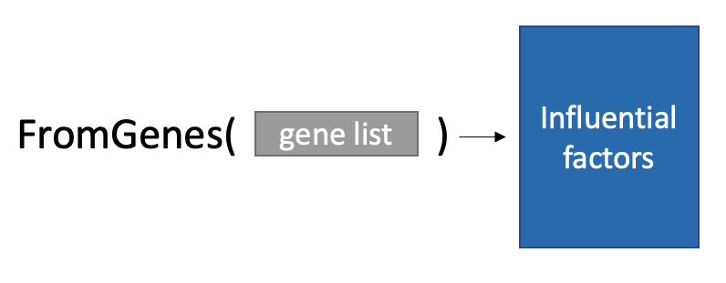
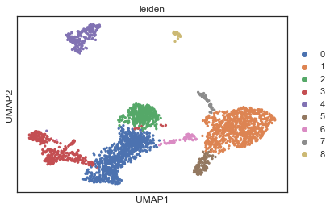
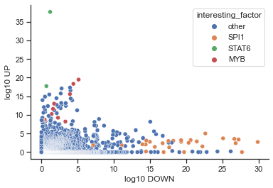
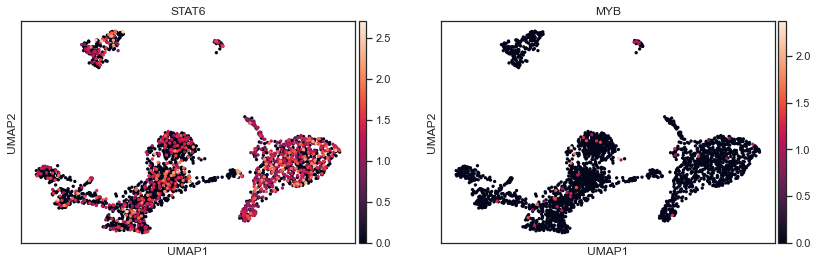
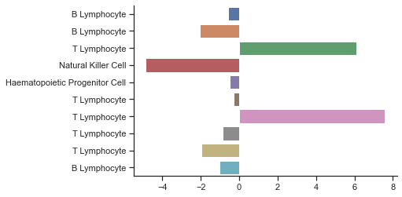
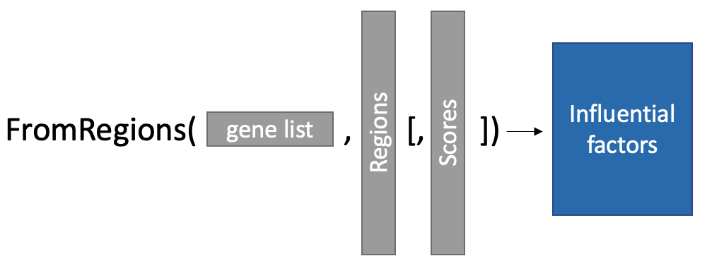
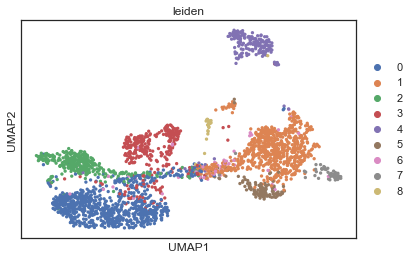
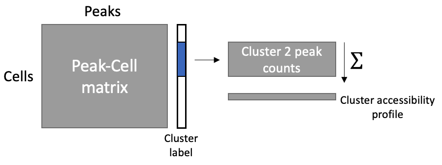
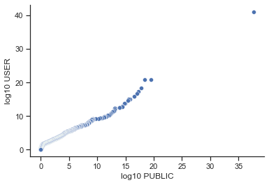
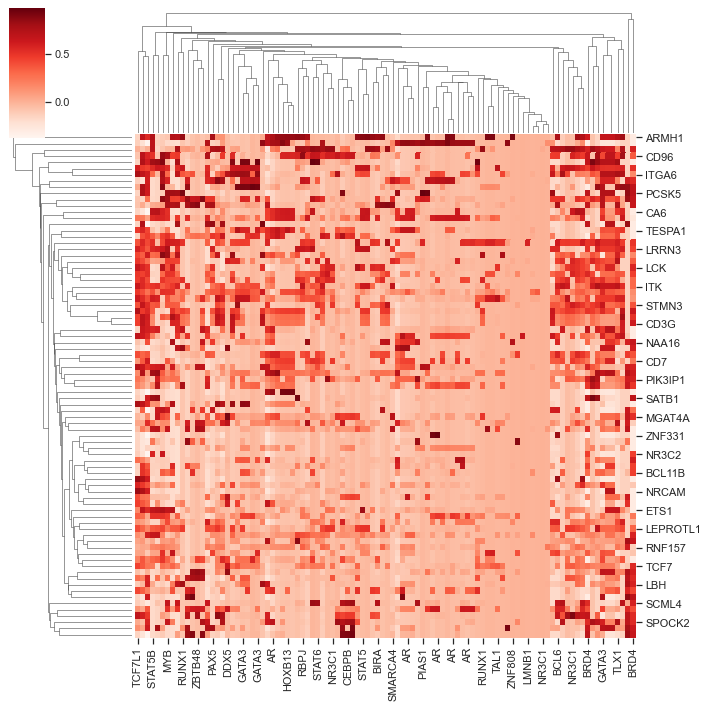

# Lisa User Guide

This notebook demonstrates the use of LISA's CLI and Python interfaces on real single-cell RNA-seq and ATAC-seq data. We'll start our investigation into human PBMC gene regulation using 10X mutliome data, which presents an interesting case when we can use DE genes and ATAC-seq regions to investigate trascription regulation.

- [Lisa FromGenes](#lisa-fromgenes)
    + [Preprocess RNA-seq data](#preprocess-rna-seq-data)
    + [Python API](#fromgenes-python-api)
    + [CLI](#fromgenes-cli)
    + [Data Analysis](#fromgenes-data-analysis)
- [Lisa FromRegions](#lisa-fromregions)
    + [Preprocess ATAC-seq data](#preprocess-atac-seq-data)
    + [Python API](#fromregions-python-api)
    + [CLI](#fromregions-cli)
    + [Data Analysis](#fromregions-data-analysis)

# Lisa FromGenes



Before we can test for influential genes using LISA, we have to process our data. First, and since we are a bit impatient, we will use the "FromGenes" interface which only requires a list of DE genes. 

From there, the tool will build an epigenetic background model using publicly-accessible data to test how factor binding, accessibility, and your genes-of-interest interact in the model system.

You can use either the Python API, or the command line interface below. They will both produce the same results.

### Preprocess RNA-seq data

We'll start by processing the RNA seq data, which you can download here:

* [10X feature matrix](https://cf.10xgenomics.com/samples/cell-arc/1.0.0/pbmc_granulocyte_sorted_3k/pbmc_granulocyte_sorted_3k_filtered_feature_bc_matrix.h5)

Required packages:
* scanpy
* pandas
* scikit-learn
* numpy
* seaborn

Run: ```conda install scanpy pandas scikit-learn numpy seaborn```


```python
import scanpy as sc
sc.settings.verbosity = 1
import pandas as pd
import anndata
from sklearn.feature_extraction.text import TfidfTransformer
from sklearn.decomposition import TruncatedSVD
import numpy as np
import seaborn as sns
import matplotlib.pyplot as plt
from matplotlib.axes._axes import _log as matplotlib_axes_logger
matplotlib_axes_logger.setLevel('ERROR')
import warnings
sns.set(style = 'ticks')
import json
```


```python
rna_data = sc.read_10x_h5('./data/pbmc_granulocyte_sorted_3k_filtered_feature_bc_matrix.h5')
rna_data.var_names_make_unique()
rna_data
```

    AnnData object with n_obs × n_vars = 2714 × 36601
        var: 'gene_ids', 'feature_types', 'genome'


Since this RNA-seq data has already been filtered for cells, we can breeze through the preprocessing (following the Scanpy [3K PBMC tutorial](https://scanpy-tutorials.readthedocs.io/en/latest/pbmc3k.html)) and obtain our cell-type clusters:


```python
sc.pp.filter_genes(rna_data, min_cells=3)
sc.pp.normalize_total(rna_data, target_sum=1e4)
sc.pp.log1p(rna_data)
sc.pp.highly_variable_genes(rna_data, min_mean=0.0125, max_mean=3, min_disp=0.5)
rna_data.raw = rna_data
sc.pp.scale(rna_data, max_value=10)
sc.tl.pca(rna_data, svd_solver='arpack', use_highly_variable=True)
sc.pp.neighbors(rna_data, n_neighbors=15, n_pcs=25)
sc.tl.umap(rna_data)
sc.tl.leiden(rna_data, resolution=0.2)
```


```python
sc.pl.umap(rna_data, color='leiden')
```
    

    


If we find differentially-expressed genes from each cluster, we can assign cell types. Using the table below (top-ranked genes for each cluster make up a column), we see that cluster #2 shows differential expression of CD8A and CD8B, so we may designate that cluster as CD8 T-cells. Let's infer what transcription factors are influential in this cell type.


```python
sc.tl.rank_genes_groups(rna_data, 'leiden', method='wilcoxon')
pd.DataFrame(data = rna_data.uns['rank_genes_groups']['names'],).head(10)
```

<div>
<table border="1" class="dataframe">
  <thead>
    <tr style="text-align: right;">
      <th></th>
      <th>0</th>
      <th>1</th>
      <th>2</th>
      <th>3</th>
      <th>4</th>
      <th>5</th>
      <th>6</th>
      <th>7</th>
      <th>8</th>
    </tr>
  </thead>
  <tbody>
    <tr>
      <th>0</th>
      <td>INPP4B</td>
      <td>DPYD</td>
      <td>LEF1</td>
      <td>NKG7</td>
      <td>BANK1</td>
      <td>FCGR3A</td>
      <td>LYZ</td>
      <td>CST3</td>
      <td>PTPRS</td>
    </tr>
    <tr>
      <th>1</th>
      <td>ANK3</td>
      <td>PLXDC2</td>
      <td>BACH2</td>
      <td>CCL5</td>
      <td>RALGPS2</td>
      <td>IFITM3</td>
      <td>RPS29</td>
      <td>HLA-DPA1</td>
      <td>TCF4</td>
    </tr>
    <tr>
      <th>2</th>
      <td>BCL11B</td>
      <td>LRMDA</td>
      <td>NELL2</td>
      <td>GNLY</td>
      <td>AFF3</td>
      <td>LST1</td>
      <td>MTSS1</td>
      <td>HLA-DRA</td>
      <td>LINC01374</td>
    </tr>
    <tr>
      <th>3</th>
      <td>LTB</td>
      <td>NEAT1</td>
      <td>THEMIS</td>
      <td>PRF1</td>
      <td>MS4A1</td>
      <td>SERPINA1</td>
      <td>MCTP1</td>
      <td>HLA-DPB1</td>
      <td>IRF8</td>
    </tr>
    <tr>
      <th>4</th>
      <td>IL7R</td>
      <td>FCN1</td>
      <td>CD8B</td>
      <td>GZMA</td>
      <td>PAX5</td>
      <td>AIF1</td>
      <td>S100A9</td>
      <td>HLA-DRB1</td>
      <td>FCHSD2</td>
    </tr>
    <tr>
      <th>5</th>
      <td>EEF1A1</td>
      <td>JAK2</td>
      <td>PDE3B</td>
      <td>CTSW</td>
      <td>CD79A</td>
      <td>FCER1G</td>
      <td>IGHM</td>
      <td>CD74</td>
      <td>PLD4</td>
    </tr>
    <tr>
      <th>6</th>
      <td>RPL11</td>
      <td>ARHGAP26</td>
      <td>OXNAD1</td>
      <td>CST7</td>
      <td>CD74</td>
      <td>PSAP</td>
      <td>SLC8A1</td>
      <td>HLA-DQA1</td>
      <td>ZFAT</td>
    </tr>
    <tr>
      <th>7</th>
      <td>RPS27</td>
      <td>VCAN</td>
      <td>CD8A</td>
      <td>SYNE1</td>
      <td>LINC00926</td>
      <td>TCF7L2</td>
      <td>CST3</td>
      <td>HLA-DQB1</td>
      <td>CCDC50</td>
    </tr>
    <tr>
      <th>8</th>
      <td>RPS27A</td>
      <td>SLC8A1</td>
      <td>BCL11B</td>
      <td>HCST</td>
      <td>IGHM</td>
      <td>IFI30</td>
      <td>HLA-DRA</td>
      <td>HLA-DRB5</td>
      <td>SLC35F3</td>
    </tr>
    <tr>
      <th>9</th>
      <td>CAMK4</td>
      <td>DENND1A</td>
      <td>CAMK4</td>
      <td>PYHIN1</td>
      <td>FCRL1</td>
      <td>CFD</td>
      <td>CD79A</td>
      <td>FLT3</td>
      <td>CUX2</td>
    </tr>
  </tbody>
</table>
</div>


We extract the top 100 differentially up-regulated and down-regulated genes associated with CD8 T-cells and store them in lists. **When running LISA, it is important to segregate up-regulated and down-regulated genes into their own tests, since different processes likely govern these responses.**


```python
cd8_up_genes = list(sc.get.rank_genes_groups_df(rna_data, group='2', log2fc_min=1.5).sort_values('pvals_adj').head(100).names.values)
cd8_down_genes = list(sc.get.rank_genes_groups_df(rna_data, group='2', log2fc_max=-1.5).sort_values('pvals_adj').head(100).names.values)
```

### FromGenes Python API


```python
from lisa import FromGenes
```

First, we instantiate a LISA test. Here, I showed all of the default arguments, but you may leave them off in the future and just provide the species. The parameters below specify a test using:
* the [enhanced RP model](https://github.com/liulab-dfci/MAESTRO/blob/master/example/Gene_activity_modelling/Gene_activity_modelling.md) to map regions to gene activity
* modeling the epigenetic background of CD8 T-cells using public DNase and H3K27ac data. 
* judging factor binding locations using public ChIP-seq data instead of motifs. 
* verbosity of 1 so we don't write too much to the console


```python
lisa_test = FromGenes('hg38', rp_map = 'enhanced_10K', 
            assays = ['Direct','DNase','H3K27ac'], isd_method = 'chipseq', verbose = 1)
```


```python
up_results, up_metadata = lisa_test.predict(cd8_up_genes, num_background_genes = 3000, background_strategy = 'regulatory')
up_results = pd.DataFrame(up_results.to_dict()) # convert tabular format to pandas DF

down_results, down_metadata = lisa_test.predict(cd8_down_genes)
down_results = pd.DataFrame(down_results.to_dict())
```

    Matching genes and selecting background ...
    81 query genes and 3000 background genes selected
    Loading data into memory (only on first prediction):
    Modeling DNase purturbations:
    Calculating ChIP-seq peak-RP p-values ...
    Modeling H3K27ac purturbations:
    Mixing effects using Cauchy combination ...
    Formatting output ...
    Done!
    Matching genes and selecting background ...
    93 query genes and 3000 background genes selected
    Modeling DNase purturbations:
    Calculating ChIP-seq peak-RP p-values ...
    Modeling H3K27ac purturbations:
    Mixing effects using Cauchy combination ...
    Formatting output ...
    Done!


### FromGenes CLI


```python
with open('data/cd8_up_genes.txt', 'w') as f:
    print('\n'.join(cd8_up_genes), file = f)
    
with open('data/cd8_down_genes.txt', 'w') as f:
    print('\n'.join(cd8_down_genes), file = f)
```

The "multi" command below processes multiple genelists sequentially. It is no different from running "oneshot" on each genelist separetly, but it is more conventient to type and reduces runtime by 1/4 by loading aspects of the LISA test into memory.


```python
!lisa multi hg38 data/cd8_*_genes.txt --rp_map enhanced_10K -o data/ --save_metadata
```

    Modeling cd8_down_genes.txt:
    	Matching genes and selecting background ...
    	93 query genes and 3000 background genes selected
    	Loading data into memory (only on first prediction):
    	Modeling DNase purturbations:
    	Calculating ChIP-seq peak-RP p-values ...
    	Modeling H3K27ac purturbations:
    	Mixing effects using Cauchy combination ...
    	Formatting output ...
    	Done!
    Modeling cd8_up_genes.txt:
    	Matching genes and selecting background ...
    	81 query genes and 3000 background genes selected
    	Modeling DNase purturbations:
    	Calculating ChIP-seq peak-RP p-values ...
    	Modeling H3K27ac purturbations:
    	Mixing effects using Cauchy combination ...
    	Formatting output ...
    	Done!
    Sample	Top Regulatory Factors:
    cd8_down_genes.txt	IRF1, STAT1, SPI1
    cd8_up_genes.txt	T, STAT6, MYB, GATA3, TAL1, STAT5B, FOXP3


```python
up_results = pd.read_csv('data/cd8_up_genes.txt.lisa.tsv', sep = '\t')
down_results = pd.read_csv('data/cd8_down_genes.txt.lisa.tsv', sep = '\t')
```


```python
with open('data/cd8_up_genes.txt.metadata.json', 'r') as f:
    up_metadata = json.loads(f.read())
```

### FromGenes Data Analysis

First, we'll manually inspect the results of our two genelists. The top contenders for regulating the highly-expressed genes appear to be STAT6 and MYB, while SPI1 shows strong results for regulating the suppressed genes.


```python
up_results.head()
```

<div>
<table border="1" class="dataframe">
  <thead>
    <tr style="text-align: right;">
      <th></th>
      <th>Rank</th>
      <th>sample_id</th>
      <th>factor</th>
      <th>cell_line</th>
      <th>cell_type</th>
      <th>tissue</th>
      <th>DNase_p_value</th>
      <th>ChIP-seq_p_value</th>
      <th>H3K27ac_p_value</th>
      <th>summary_p_value</th>
    </tr>
  </thead>
  <tbody>
    <tr>
      <th>0</th>
      <td>1</td>
      <td>4597</td>
      <td>STAT6</td>
      <td>None</td>
      <td>T Lymphocyte</td>
      <td>Cord blood</td>
      <td>5.203406e-15</td>
      <td>7.275850e-39</td>
      <td>0.999193</td>
      <td>2.182755e-38</td>
    </tr>
    <tr>
      <th>1</th>
      <td>2</td>
      <td>58805</td>
      <td>MYB</td>
      <td>None</td>
      <td>Th1</td>
      <td>None</td>
      <td>1.420656e-10</td>
      <td>1.092114e-20</td>
      <td>0.979036</td>
      <td>3.276341e-20</td>
    </tr>
    <tr>
      <th>2</th>
      <td>3</td>
      <td>58806</td>
      <td>MYB</td>
      <td>None</td>
      <td>Th2</td>
      <td>None</td>
      <td>1.099507e-08</td>
      <td>1.525529e-19</td>
      <td>0.953359</td>
      <td>4.576588e-19</td>
    </tr>
    <tr>
      <th>3</th>
      <td>4</td>
      <td>4598</td>
      <td>STAT6</td>
      <td>None</td>
      <td>T Lymphocyte</td>
      <td>Cord blood</td>
      <td>3.043435e-10</td>
      <td>6.298881e-19</td>
      <td>0.311276</td>
      <td>1.889664e-18</td>
    </tr>
    <tr>
      <th>4</th>
      <td>5</td>
      <td>73454</td>
      <td>T</td>
      <td>None</td>
      <td>Th1</td>
      <td>None</td>
      <td>3.923809e-07</td>
      <td>1.539948e-18</td>
      <td>0.988320</td>
      <td>4.619844e-18</td>
    </tr>
  </tbody>
</table>
</div>

```python
down_results.head()
```

<div>
<table border="1" class="dataframe">
  <thead>
    <tr style="text-align: right;">
      <th></th>
      <th>Rank</th>
      <th>sample_id</th>
      <th>factor</th>
      <th>cell_line</th>
      <th>cell_type</th>
      <th>tissue</th>
      <th>DNase_p_value</th>
      <th>ChIP-seq_p_value</th>
      <th>H3K27ac_p_value</th>
      <th>summary_p_value</th>
    </tr>
  </thead>
  <tbody>
    <tr>
      <th>0</th>
      <td>1</td>
      <td>50365</td>
      <td>SPI1</td>
      <td>None</td>
      <td>Monocyte</td>
      <td>None</td>
      <td>3.219821e-21</td>
      <td>4.660155e-31</td>
      <td>3.899215e-17</td>
      <td>1.398047e-30</td>
    </tr>
    <tr>
      <th>1</th>
      <td>2</td>
      <td>34929</td>
      <td>SPI1</td>
      <td>None</td>
      <td>Monocyte</td>
      <td>None</td>
      <td>7.599098e-17</td>
      <td>7.111733e-29</td>
      <td>4.303568e-14</td>
      <td>2.133520e-28</td>
    </tr>
    <tr>
      <th>2</th>
      <td>3</td>
      <td>67928</td>
      <td>SPI1</td>
      <td>None</td>
      <td>Macrophage</td>
      <td>Blood</td>
      <td>5.238969e-17</td>
      <td>2.050410e-28</td>
      <td>6.434368e-14</td>
      <td>6.151231e-28</td>
    </tr>
    <tr>
      <th>3</th>
      <td>4</td>
      <td>50367</td>
      <td>SPI1</td>
      <td>None</td>
      <td>Monocyte</td>
      <td>None</td>
      <td>4.799501e-20</td>
      <td>5.230665e-28</td>
      <td>5.748676e-16</td>
      <td>1.569200e-27</td>
    </tr>
    <tr>
      <th>4</th>
      <td>5</td>
      <td>67926</td>
      <td>SPI1</td>
      <td>None</td>
      <td>Macrophage</td>
      <td>Blood</td>
      <td>3.445293e-17</td>
      <td>7.859059e-28</td>
      <td>1.395392e-13</td>
      <td>2.357718e-27</td>
    </tr>
  </tbody>
</table>
</div>


We may be interested in how specific these two factors are to our genelists. For example, is SPI selectively regulating genes that show suppression in CD8 T-cells, or is it mediating a whole-cell response? We can join our two dataframe together on sample ID to compare how factors jointly influence the up-regulated and down-regulated genes:


```python
joined_results = down_results.merge(up_results[['sample_id','summary_p_value']], on = 'sample_id',
                suffixes=['_down','_up'])
```

Transform to -log10(p_value) for easier plotting:


```python
joined_results['log10 UP'] = -np.log10(joined_results.summary_p_value_up)
joined_results['log10 DOWN'] = -np.log10(joined_results.summary_p_value_down)
```

Add a column to color our interesting factors:


```python
interesting_factors = ['SPI1', 'STAT6','MYB']

joined_results['interesting_factor'] = np.where(np.isin(joined_results.factor.values, interesting_factors),
                joined_results.factor, 'other')
```

Make the plot!


```python
sns.scatterplot(data = joined_results, x = 'log10 DOWN', y = 'log10 UP', hue='interesting_factor',
               hue_order = ['other'] + interesting_factors)
sns.despine()
```
    

    

As you can see, influence of SPI1 seems to be very specific for the down-regulated genes, while STAT6 and MYB appear to be specific to the up-regulated genes! LISA says these factors are influential in our genesets. Let's see if factor expression coincides with influence:


```python
sc.pl.umap(rna_data, color = ['STAT6','MYB'])
```


    


Despite both of these factors having known influence on CD8 T-cell gene regulation, their expression alone is not indicative. This shows the value of integrative evidence through LISA.

Now, let's see how we arrived at this result for the up-regulated genes. In the up_results dataframe above, the "DNase p-value" was very significant for STAT6 and MYB. We can inspect the "up_metadata" we saved earlier to see how the DNase background for CD8 T-cells was modeled. LISA selects representative epigentic background from a diverse set of public data, and we can see here that LISA selected primarily T-lymphocite samples to comprise our background.


```python
pd.DataFrame(up_metadata['DNase']['selected_dataset_meta'])
```

<div>
<table border="1" class="dataframe">
  <thead>
    <tr style="text-align: right;">
      <th></th>
      <th>sample_id</th>
      <th>cell_line</th>
      <th>cell_type</th>
      <th>tissue</th>
    </tr>
  </thead>
  <tbody>
    <tr>
      <th>0</th>
      <td>3138</td>
      <td>NaN</td>
      <td>B Lymphocyte</td>
      <td>Spleen</td>
    </tr>
    <tr>
      <th>1</th>
      <td>3139</td>
      <td>NaN</td>
      <td>B Lymphocyte</td>
      <td>Spleen</td>
    </tr>
    <tr>
      <th>2</th>
      <td>3147</td>
      <td>NaN</td>
      <td>T Lymphocyte</td>
      <td>Blood</td>
    </tr>
    <tr>
      <th>3</th>
      <td>3149</td>
      <td>NaN</td>
      <td>Natural Killer Cell</td>
      <td>Blood</td>
    </tr>
    <tr>
      <th>4</th>
      <td>3196</td>
      <td>NaN</td>
      <td>Haematopoietic Progenitor Cell</td>
      <td>Blood</td>
    </tr>
    <tr>
      <th>5</th>
      <td>40395</td>
      <td>NaN</td>
      <td>T Lymphocyte</td>
      <td>Blood</td>
    </tr>
    <tr>
      <th>6</th>
      <td>40921</td>
      <td>NaN</td>
      <td>T Lymphocyte</td>
      <td>Blood</td>
    </tr>
    <tr>
      <th>7</th>
      <td>44909</td>
      <td>NaN</td>
      <td>T Lymphocyte</td>
      <td>Blood</td>
    </tr>
    <tr>
      <th>8</th>
      <td>45019</td>
      <td>Jurkat</td>
      <td>T Lymphocyte</td>
      <td>Blood</td>
    </tr>
    <tr>
      <th>9</th>
      <td>47606</td>
      <td>L591</td>
      <td>B Lymphocyte</td>
      <td>Blood</td>
    </tr>
  </tbody>
</table>
</div>


Each dataset is also associated with a coefficient. Below, we can see that the two most influential backgrounds are T Lymphocyte samples!


```python
ax = sns.barplot(x = up_metadata['DNase']['chromatin_model']['coefs'], 
            y= up_metadata['DNase']['selected_dataset_meta']['sample_id'])
ax.set_yticklabels(up_metadata['DNase']['selected_dataset_meta']['cell_type'])
sns.despine()
plt.show()
```


    

# Lisa FromRegions



Results from the public epigenetic data look good, but we can further tailor the Lisa test to our data. Since we are working with Mutliome data, we have cells jointly assayed with ATAC-seq and RNA-seq. We can supply our own peaks instead of using public epigenetic data to get results even more specific to our conditions.

You don't need multiome data to take advantage of this test, however. [Integrating scATAC and scRNA seq](https://satijalab.org/signac/articles/pbmc_multiomic.html), or conducting a bulk ATAC-seq experiment with known query genes are common situations where Lisa's FromRegions interface is useful.

The FromRegions test takes a genelist and and a list of regions defining accessibility in your system. Each of these regions may also be accompanied by a positive weight. Below, we use aggregated reads in a scATAC cluster to define our epigenetic profile, but you may also provide the regions from a bulk ATAC-seq experiment, H3K27ac, etc. *While this approach is similar to motif enrichment analysis, it adds the additional constraint that your binding sites must be influential on certain genes.*

### Preprocess ATAC-seq data

10X's CellRanger peak calling algorithm often merges peaks that are nearby, creating wide, nonspecific peaks that may confound motif/tf binding analysis, so here, we download their fragment file and construct the peak-count matrix ourselves.

* [10X fragment file](https://cf.10xgenomics.com/samples/cell-arc/1.0.0/pbmc_granulocyte_sorted_3k/pbmc_granulocyte_sorted_3k_atac_fragments.tsv.gz)

Place these files in a subfolder called "data" and decompress the fragment file.

Next, we will call peaks using MACS2:

```python
!macs2 callpeak -t data/pbmc_granulocyte_sorted_3k_atac_fragments.tsv \
    -f BEDPE -g hs --keep-dup 1 -B -q 0.05 --nomodel --extsize=50 \
    --SPMR -n pbmc --outdir data/
```

We use bedtools to intersect the fragments with the peaks, making a record of every barcode-peak interaction.


```python
!bedtools intersect -a data/pbmc_granulocyte_sorted_3k_atac_fragments.tsv \
    -b <(cat ./data/pbmc_peaks.narrowPeak | cut -f1-3 ) -wa -wb > data/barcode_peak_intersections.tsv
```

Using the list of barcode-peak interactions, we may create a sparse peak count matrix using the function below:


```python
from scipy import sparse

def make_sparse_matrix(fragment_file, barcode_pos = 3, peak_pos = 5):
    barcodes = {}
    peaks = {}

    def get_index(value, encountered):

        if value in encountered:
            return encountered[value]
        else:
            i = len(encountered)
            encountered[value] = i
            return i

    data, rows, cols = [],[],[]
    for line in fragment_file:
        line = line.strip().split('\t')

        barcode = line[barcode_pos]
        peak = tuple(line[peak_pos: peak_pos + 3])

        i = get_index(barcode, barcodes)
        j = get_index(peak, peaks)

        data.append(1)
        rows.append(i)
        cols.append(j)

    matrix = sparse.coo_matrix((data, (rows, cols)), shape = (len(barcodes), len(peaks)))
    
    return matrix, list(barcodes.keys()), list(peaks.keys())

with open('data/barcode_peak_intersections.tsv', 'r') as f:
    peak_counts, barcodes, peaks = make_sparse_matrix(f)
```

And convert that sparse matrix to an Anndata object:


```python
atac_data = anndata.AnnData(X = peak_counts.tocsr(), obs = pd.DataFrame(barcodes, columns = ['barcode']).set_index('barcode'),
        var = pd.DataFrame(peaks, columns = ['chrom','start','end']))
```

```python
atac_data = atac_data[rna_data.obs.index, :]

atac_data
```

    View of AnnData object with n_obs × n_vars = 2714 × 78511
        var: 'chrom', 'start', 'end'


Next, we perform dimensionality reduction on the ATAC-seq data so that can visualize how the epigenetic manifold matches the clusters we learned from gene expression. 


```python
def process_counts(andata):
    
    lsi_model = TruncatedSVD(n_components=50)
    X_LSI = lsi_model.fit_transform(
        TfidfTransformer().fit_transform(andata.X)
    )

    andata.obsm['X_lsi'] = X_LSI
    
    sc.pp.neighbors(andata, use_rep = 'X_lsi')

    sc.tl.umap(andata)
    
    return lsi_model

process_counts(atac_data)
```

```python
atac_data.obs = atac_data.obs.join(rna_data.obs)
```

Using the UMAP learned from ATAC-seq and the clusters learned from RNA-seq, we can see the two measures correspond nicely, and that cells from cluster #2, our CD8 T-cells, appear to associate with a distinct epigentic state.


```python
sc.pl.umap(atac_data, color='leiden')
```

    

    

We can create the average accessibility signature of a CD8 T-cell by aggregating reads to the cluster level. Below, I subset the cell-peak matrix for CD8 T-cells, then add the profile of every cell.



```python
cd8_profile = np.array(atac_data[atac_data.obs.leiden == '2'].X.sum(axis = 0)).reshape(-1)
```

This produces an array that contains the number of reads in each peak accross all CD8 T-cells.


```python
cd8_profile.shape
```

    (78511,)


#### FromRegions Python API


```python
from lisa import FromRegions
```


```python
lisa_test = FromRegions('hg38', peaks, rp_map = 'enhanced', rp_decay = 10000)
```

    Validation user-provided regions ...
    WARNING: 18 regions encounted from unknown chromsomes: GL000194.1,GL000205.2,GL000195.1,GL000219.1,KI270726.1,KI270713.1


```python
results, metadata = lisa_test.predict(cd8_up_genes, region_scores= cd8_profile, 
                    background_strategy = 'all')
```

    Matching genes and selecting background ...
    81 query genes and 18357 background genes selected
    Loading data into memory (only on first prediction):
    	Loading regulatory potential map ...
    	Loading binding data ...
    	Done!
    Modeling insilico deletions:
    	Calcuating null RP model ...
    	Performing knockouts ...
    	Calculating Δ regulatory score ...
    	Calculating p-values ...
    Done!
    Formatting output ...
    Done!


```python
results = pd.DataFrame(results.to_dict())
```

### FromRegions CLI


```python
with open('./data/cd8_region_profile.bed', 'w') as f:
    for peak, score in zip(peaks, cd8_profile):
        print(*peak, score, sep = '\t', file = f)
```


```python
!lisa regions hg38 -q data/cd8_up_genes.txt -r data/cd8_region_profile.bed --rp_map_style enhanced \
    --save_metadata -o data/cd8_regions_test --save_metadata
```

    Validation user-provided regions ...
    WARNING: 18 regions encounted from unknown chromsomes: GL000194.1,GL000205.2,GL000195.1,GL000219.1,KI270726.1,KI270713.1
    Matching genes and selecting background ...
    81 query genes and 18357 background genes selected
    Loading data into memory (only on first prediction):
    	Loading regulatory potential map ...
    	Loading binding data ...
    	Done!
    Modeling insilico deletions:
    	Calcuating null RP model ...
    	Performing knockouts ...
    	Calculating Δ regulatory score ...
    	Calculating p-values ...
    Done!
    Formatting output ...
    Done!


```python
results = pd.read_csv('./data/cd8_regions_test.lisa.tsv', sep = '\t')

with open('data/cd8_down_genes.txt.metadata.json', 'r') as f:
    metadata = json.loads(f.read())
```

You can also perform the FromRegions test directly on the output of MACS is you do not need to further process the data by addding the "--macs_xls" flag. 

```python
!lisa regions hg38 -q data/cd8_up_genes.txt -r data/pbmc_peaks.xls --macs_xls --save_metdata > results.tsv
```

## FromRegions Data Analysis


If we inspect the results, we can see STAT6, MYB, and GATA3 again show strong influence on our genes-of-interest. 

```python
results.head(5)
```


<div>
<table border="1" class="dataframe">
  <thead>
    <tr style="text-align: right;">
      <th></th>
      <th>Rank</th>
      <th>sample_id</th>
      <th>factor</th>
      <th>cell_line</th>
      <th>cell_type</th>
      <th>tissue</th>
      <th>Regions_p_value</th>
      <th>summary_p_value</th>
    </tr>
  </thead>
  <tbody>
    <tr>
      <th>0</th>
      <td>1</td>
      <td>4597</td>
      <td>STAT6</td>
      <td>None</td>
      <td>T Lymphocyte</td>
      <td>Cord blood</td>
      <td>8.209163e-42</td>
      <td>8.209163e-42</td>
    </tr>
    <tr>
      <th>1</th>
      <td>2</td>
      <td>4598</td>
      <td>STAT6</td>
      <td>None</td>
      <td>T Lymphocyte</td>
      <td>Cord blood</td>
      <td>1.074252e-21</td>
      <td>1.074252e-21</td>
    </tr>
    <tr>
      <th>2</th>
      <td>3</td>
      <td>68161</td>
      <td>GATA3</td>
      <td>None</td>
      <td>Thymocyte</td>
      <td>Thymus</td>
      <td>1.469225e-21</td>
      <td>1.469225e-21</td>
    </tr>
    <tr>
      <th>3</th>
      <td>4</td>
      <td>58806</td>
      <td>MYB</td>
      <td>None</td>
      <td>Th2</td>
      <td>None</td>
      <td>3.662904e-19</td>
      <td>3.662904e-19</td>
    </tr>
    <tr>
      <th>4</th>
      <td>5</td>
      <td>58811</td>
      <td>GATA3</td>
      <td>None</td>
      <td>Th2</td>
      <td>None</td>
      <td>3.715515e-18</td>
      <td>3.715515e-18</td>
    </tr>
  </tbody>
</table>
</div>


Further, if we compare the p-values of the results using the FromGenes and FromUsers interfaces, they are extremely similar. This indicates that LISA was able to build a very good model for the epigenetic state of a T-cell from public data, as expected. However, if your condition is not well represented by public data, the FromRegions test will provide much stronger predictions.

```python
results.sample_id = up_results.sample_id.astype(int)
compare_results = results.merge(up_results[['sample_id', 'summary_p_value']], on = 'sample_id', suffixes = ['_user','_public'])
compare_results[['log10 USER', 'log10 PUBLIC']] = \
    -np.log10(compare_results[['summary_p_value_user','summary_p_value_public']])
sns.scatterplot(data = compare_results, x = 'log10 PUBLIC', y = 'log10 USER')
sns.despine()
```



    

Lastly, the FromRegions test allows the user to inspect the gene-TF influence predicted by LISA to determine potential regulatory circuits. From the metadata return of the lisa test,
we can extract the delta_reg matrix for our query genes from: ```metadata['Regions']['query_reg_scores']```. This matrix contains the predicted influence on each query gene by the top 100 factors.


```python
query_reg_scores = pd.DataFrame(
    metadata['Regions']['query_reg_scores']-\
    metadata['Regions']['background_reg_scores'].mean(axis = 0).reshape(1,-1), 
            index = metadata['query_symbols'], columns = results.factor[:100].values)
```


```python
sns.clustermap(query_reg_scores, cmap = sns.color_palette("Reds", as_cmap=True))
```


    
According to our model for factor influence, our top regulatory factor, STAT6, interacts specifically with some gene clusters. The two main gene clusters contain CD7 and LCK. CD7 is a lymphoid factor implicated in T-cell - B-cell interactions, while LCK is a key signaling transducer of TCR stimulation.